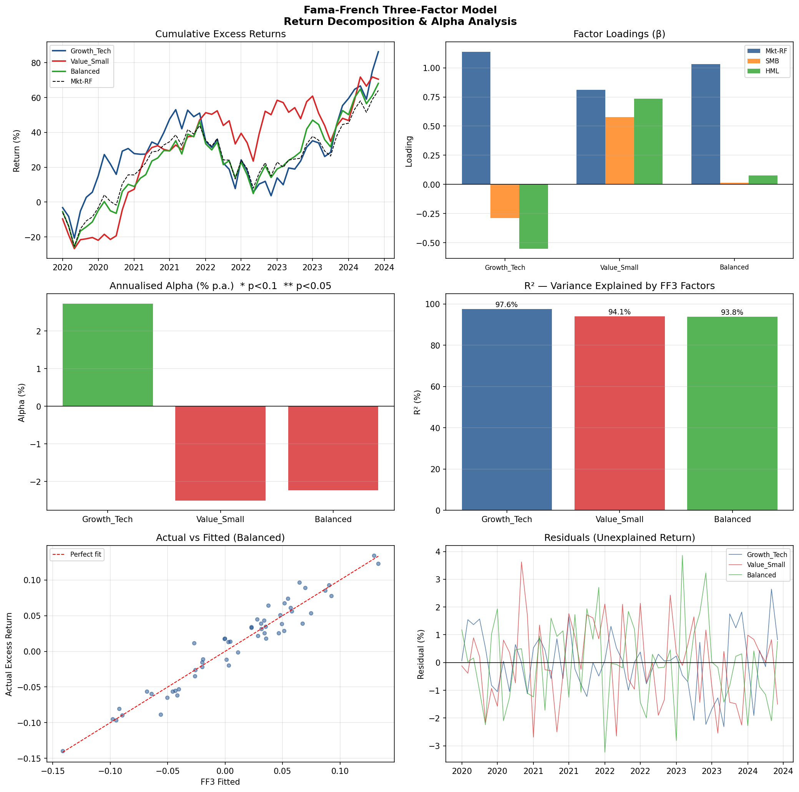

# Fama-French Three-Factor Model

Runs time-series OLS regressions of three simulated equity portfolios on the Fama-French factors (Mkt-RF, SMB, HML), decomposes return sources, estimates and tests for alpha, and visualises factor exposures and R².



## The model

```
Rₚ − Rᶠ = α + β₁(Mkt−RF) + β₂·SMB + β₃·HML + εₜ
```

| Factor | Stands for | Captures |
|--------|-----------|----------|
| **Mkt-RF** | Market excess return | Systematic equity risk |
| **SMB** | Small Minus Big | Size premium |
| **HML** | High Minus Low | Value premium (book-to-market) |
| **α** | Jensen's alpha | Risk-adjusted outperformance |

## Results

| Portfolio | α (ann.) | t-stat | β_Mkt | β_SMB | β_HML | R² |
|-----------|---------|--------|-------|-------|-------|----|
| Growth_Tech | +2.73% | 1.44 | 1.138 | −0.288 | −0.551 | 97.6% |
| Value_Small | −2.50% | −0.98 | 0.810 | +0.578 | +0.734 | 94.1% |
| Balanced | −2.23% | −0.84 | 1.032 | +0.014 | +0.076 | 93.8% |

High R² (>93%) confirms that most return variation is explained by the three systematic factors. The insignificant alpha estimates are consistent with the efficient market hypothesis over this period.

## How to run

```bash
pip install -r requirements.txt
python fama_french.py
```

## Using real data

Factor data is freely available from Ken French's data library:

```python
import pandas_datareader as pdr
ff3 = pdr.get_data_famafrench("F-F_Research_Data_Factors", start="2015-01")[0] / 100
```

For portfolio returns, download stock prices from yfinance and compute monthly returns.

## Interpretation guide

- **β_Mkt > 1**: more volatile than the market (aggressive)
- **β_SMB > 0**: tilted towards small-cap stocks
- **β_HML > 0**: tilted towards value stocks (high book-to-market)
- **α significant**: manager/strategy adds risk-adjusted return beyond factor exposure

## Extensions

- Fama-French 5-factor model (adds RMW profitability, CMA investment)
- Carhart 4-factor (adds momentum)
- Rolling-window regressions to detect time-varying factor exposures
